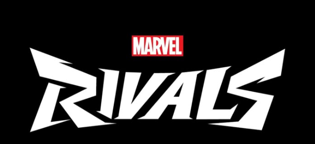

# COP-3330C-Module-8-Phase2
This Repository was created for Software Implementation Phase 2 - Software Testing. It includes the .zip file / and the resources that the program uses.

**Name:** Kenji Nakanishi 
**Course:** CEN 3024C Software Development-I 
**CRN:** 14877

**Description of the project: **

Marvel Rivals is a shooting game that is becoming very popular among PC & PS5 gamers. I also enjoy this game so much that I wanted to create a DMS based on this game!

This console based a will allow user to use Create, Remove. Update, Delete hero records (Marvel Rivals) from the file stored either can be used .txt or .csv or open from your personal computer. It has a custom method which creates a PDF on Win Rate % calculated by the MarvelRivals.com where they base on the won matches / matches played * 100.

I have collected this records with +42 data of the current season as of October 2025 for our use.
** you can also load your personal file, just need to type the absolute path!

Now in the Phase 2 Software Testing, The NavigationMenuTest will be running test cases with wrong data and information trying to brake the program. 

This console based app basically work with the below 3 files:

**NavigationMenuTest.java** 

which contain the test cases that will be conducted: 

The UML model is as follow:
Might be difficult to see but these test were previously planned on the course while we designed the test cases. 

Access Canva site: 
https://www.canva.com/design/DAG07aTaRiE/BeaOak-9wV0z5ZcLjhoKgw/edit

**Tools used:**
- Java language
- IDE: JetBrain IntelliJ IDE
- Maven
- Canva
  
  
